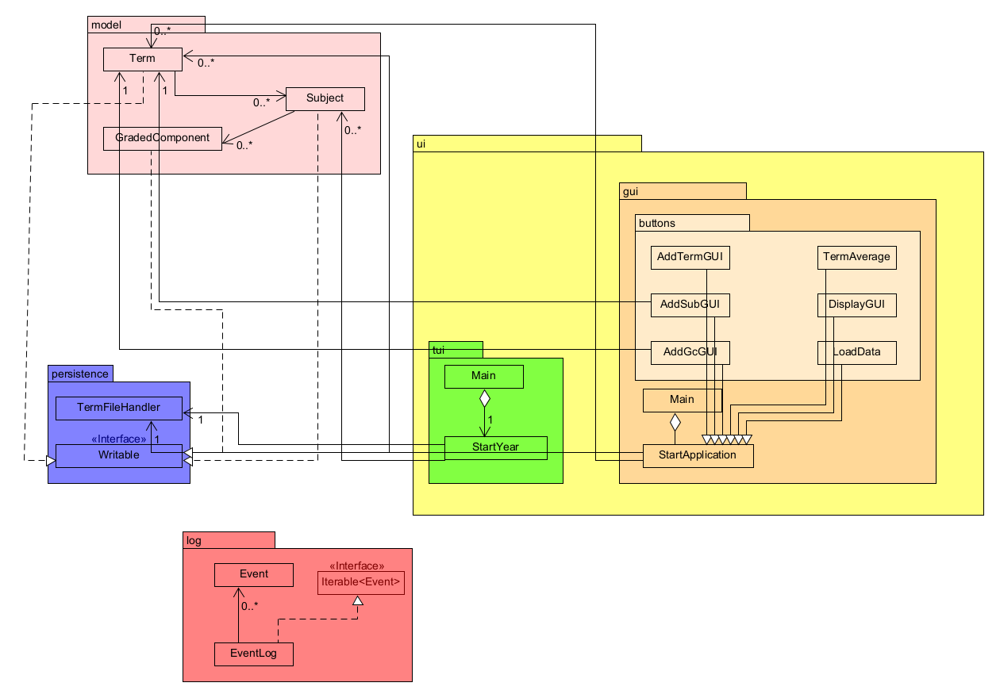

# My Personal Project

## Grades Recorder

The application solves following *problems*:
- **What will the application do?**
This application can be used to **store** the marks of quizzes,assignments, midterms and finals results of all the subject
in a term of a university student. It can calculate *average* score/percent and compare it with pre entered *expected*
score as well as *predict* the amount of marks a student needs to obtain to meet the desired score.

- **Who will use it?**
*University **students*** as well as *school **students*** can use it to keep a track of their grade record.

- **Why is this project of interest to you?**
This project is very important to me as being a *university student* myself, I did all of these tasks defined above
**manually** and had to rely on a sheet of paper. **Automating** these would save time and give me accurate results without
the hassle of storing all of this information in my memory.

## User Stories

- **As a user,** I want to be able to *add* a new term to a new year, or add another term to an existing year.
- **As a user,** I want to be able to *add* my subjects this term.
- **As a user,** I want to be able to *enter* my grades for quizzes, assignments and tests in each subject.
- **As a user,** I want to be able to *add* my expected score in this course.
- **As a user,** I want to be able to *get* an average percentage of my term.
- **As a user,** I want to be able to *view* the marks I need to obtain to achieve my desired percentage.
- **As a user,** I want to be able to *save* my entire transcript so far.
- **As a user,** I want to be able to *load* my previously saved transcript.

## Instructions for User

- You can generate the first required action related to adding Xs to a Y by clicking on "add term" button to create a
new term and add it to termlist
- You can generate the second required action related to adding Xs to a Y by clicking on "add subject" button to 
create a new subject and add it to an existing term
- You can generate the third required action related to adding Xs to a Y by clicking on "add graded component" button to
create a new gc and add it to an existing subject
- You can locate my visual component by looking at the images that get displayed during execution of the program
- You can save the state of my application automatically when u add a new term, subject or graded component
- You can reload the state of my application by clicking on the "load data button"

## Phase 4: Task 2
### Sample Logging of Events
~~~
Wed Aug 09 16:00:45 PDT 2023
Subject: POLI added to:  2023-T1
-------------------------------------------------------------
Wed Aug 09 16:00:05 PDT 2023
Graded Component:  quiz added to POLI
-------------------------------------------------------------
Wed Aug 09 16:01:07 PDT 2023
Average 47.6 calculated for:  2023 term num: 1
-------------------------------------------------------------
Wed Aug 09 16:01:07 PDT 2023
Average 47.45 calculated for:  2023 term num: 2
-------------------------------------------------------------
Wed Aug 09 16:01:07 PDT 2023
Average 0.0 calculated for:  2024 term num: 1
-------------------------------------------------------------
Wed Aug 09 16:01:07 PDT 2023
Average 9.7 calculated for:  2025 term num: 2
-------------------------------------------------------------

Process finished with exit code 0
~~~

## Phase 4: Task 3

### UML Class Diagram

### Potential Design Improvements
- In the GUI package of the code, in the StartApplication class, we can refactor the code for the buttons as there is a 
lot of repetition and redundancy. To fix this, we can extract a single new method and call it in every separate call 
of each button
- The code for Subject, Term and Graded Component share a lot of similar code which can be simplified by creating 
a single abstract class that defines shared functions
- The termList field can be simplified by using singleton method as we only need one instance of it every time we run
the code.
- A separate save button can be added in the GUI to reduce the repetition. 
- Different datatype can be explored for term, subject and graded components. 
